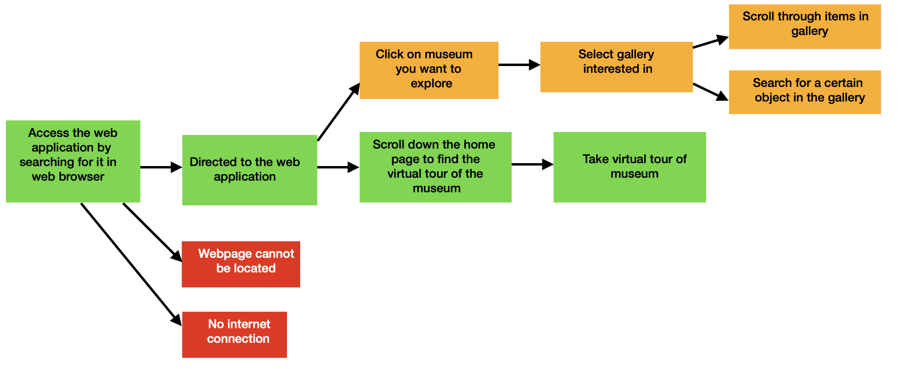
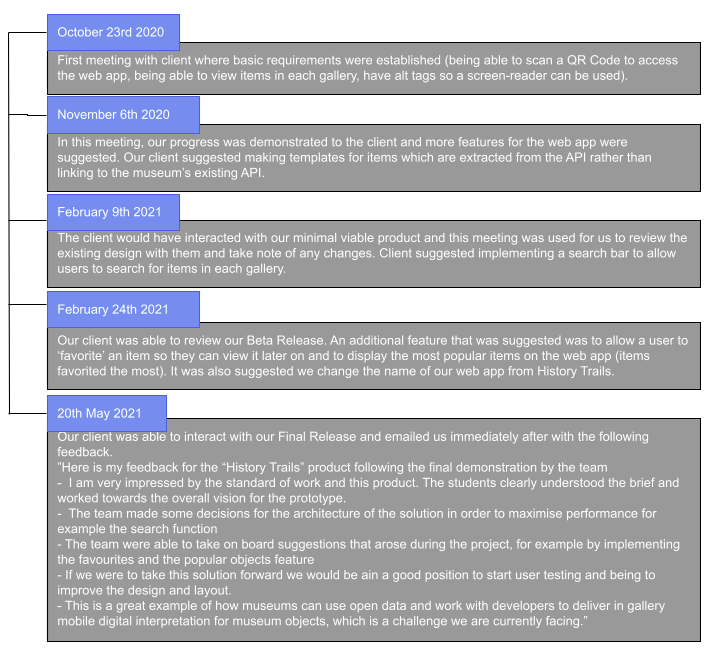

**History Trails - Portfolio B**

Gabrielle Balgobin, Lokhei Wong, Rares Bucur, Sergiu Avacaritei, Zulin Tian

**Overview**

Our group has been tasked with developing a software solution for a real life client. We used the agile development methodology which allowed us to write and refactor code at a constant, sustainable pace while accomplishing our objectives. 

Our Client

Our client for this project is the Bristol Museum and Art Gallery and M Shed management. Both museums are part of Bristol Culture, and aim to showcase different pieces of artwork by many internationally famous artists, as well as the history of Bristol. Our main point of contact is Mark Pajak, head of Digital Development at Bristol Culture. As the strategic lead on digital and user experience, he has a particular interest in meeting user needs and providing the best user experience. 

Our Application Domain

Bristol is a city which has a rich culture and is a buzzing hive of activity. Bristol’s tourism economy is worth approximately £1.4bn and supports more than 29,000 jobs. Two of the top rated tourist attractions in Bristol are the Bristol Museum and Art Gallery and the M-Shed. With the outbreak of the novel coronavirus, the total number of visits to the DCMS-sponsored museums and galleries in the last quarter of 2020 decreased by 89%. It is likely that the Bristol Museum and Art Gallery and the M-Shed are following a similar trend. By developing a web app for Bristol Museum and Art Gallery and M shed, this will improve visitors’ experience at the museum by making the general population feel safe enough to enjoy the artwork and culture, thus encouraging museum visits. Also, by allowing people to take a tour of the museum virtually through our web app, this might generate interest and encourage more people to visit the museum when it is safe to do so.

The Project 

Bristol Museum and M Shed currently have a legacy touch screen digital interpretation system which is placed at specific locations in the museum for users to interact with. Since the start of the pandemic, this has been shut down to safeguard employees and visitors. We have created a web app as an alternative for visitors to attain more information about the objects on display as they walk around. This is a lot more convenient compared to the interpretation system, which has location-specificity. Every visitor can use the web app simultaneously, whereas there are a limited number of interactive systems in the museum. To maximise user experience, we added extra functionality - favourites and popular. Museums attract persons with different levels of technological literacy and accessibility limitations. Therefore, we aim to cater for as many stakeholders as possible by ensuring the web app is accessible to everyone. We would also need to try to satisfy our client's requirements whilst evaluating what is feasible given the project’s limited time frame and our abilities.

Our Vision

Our web app must meet our client’s needs and show basic information about the object of interest. The web app should be easy to navigate, providing a pleasant user experience. In order to improve ease of access, we plan to have a QR code so that visitors can scan the code and be directed to our website. In the case that the visitors are unable to scan the QR codes, they would also be able access the website manually.

**Requirements**

**System Stakeholders**

Our software development project will cater to the needs of numerous groups who have a vested interest in the final product. These people, termed as ‘stakeholders’, will be identified below. We have written the names of user stakeholders in **bold**.

**Curator**: Olivia is The Curator of Bristol Museum & Art Gallery. She is responsible for acquiring, maintaining, displaying and interpreting collections of artefacts or art with the intention of enlightening the public.  She expects to understand the software as part of enhancing visitors’ experiences. She believes that this new digital platform will present new opportunities for her to disseminate collections.

**Educational Coordinators**: Amelia and George are the educational coordinators of Bristol Museum & Art Gallery. Their job is to ensure that collections in the museum act as a learning resource for people of all ages by planning, coordinating, and implementing educational events, workshops, and lectures, in particular focusing on those who may not conventionally use the museum. 

**Museum visitors**: 

- **Little Ava**- A pupil under the age of 12 on a school trip or a family outing. Little Ava can either aim to attain information for a school project or just wants to be entertained during a family outing. Little Ava has a developing technological literacy and she loves to use her mum’s iPad to play Angry Birds. 
- **Noah**- A seventeen year old boy who is visiting the Bristol Museum and Art Gallery as part of a trip to Bristol to check out the university. Noah is proficient in using technology but is lazy so he wants to explore the museum using the least amount of energy possible. 
- **Isla** - A 30-year-old woman who lives in Bristol and loves to spend her free time exploring the Bristol Museum and Art Gallery. Isla uses her phone a lot for work purposes and to regularly update her social media profiles. She therefore has good technical literacy. 
- **Old man Harry** - Old man Harry is 70 years old but is still a national trust enthusiast. Since he retired, he regularly visits nearby museums. Old man Harry is not the most tech savvy person as he only recently purchased a smartphone to stay in contact with his grandchildren.

**Researchers**: Emily, Jack and Sophia are a team of researchers who tour historical sites across Great Britain in order to obtain content for their historical blog and popular TV show.  

Bristol City Council: The Bristol Museum & Art Gallery is part of Bristol Museums which is a group of museums, historic houses, galleries and archives in Bristol which patrons can visit for free. Bristol City Council is the local authority of Bristol and therefore supports the museum and has the overall responsibility for the management of the museum.

Art Council England: The Bristol Museum & Art Gallery is supported and funded by Art Council England which is a non-departmental public body of the Department for Digital, Culture, Media and Sport. It invests in artistic/cultural experiences across museums and libraries.

Project team: Lokhei, Zulin, Sergiu, Rares and Gabrielle make up the project team who was assigned this Software Development Project. The five members must carefully plan and collaborate in order to produce a functional product.

**User Stories**

Below we have listed three of the most essential user stories for each of our user stakeholders.

**As a Curator...**

- My major job role is to disseminate information to the public so I need to be able to search for objects in the museum to acquire information in a swift manner.
- I help manage the institution and provide museum employees with assistance and guidance so I need to be able to fully understand the application so I can answer any questions staff or even museum visitors may have.
- I am responsible for the presentation of the works of art in the museum so I want a feature to show me the most popular items so that I can highlight them in special ways.

**As an educational coordinator...**

- I’m always being asked questions by museum visitors so I want to be able to search for items quickly to provide information efficiently.
- I plan events very often so I want to be able to view the most popular items in the museum so I can plan activities for museum visitors around them.
- I sometimes want to highlight one gallery in particular so I want to be able to view items by gallery so I can organise activities more efficiently.

**As a juvenile museum visitor (Little Ava) ...**

- I’m not that good with technology as yet so I want to be able to access and navigate the application easily so I can use it throughout the museum visit.
- I don't really know what interests me in the museum so I want to be able to look at the most popular (most favorited) objects in the museum. 
- My parents usually take me to visit the museum but because of Covid they can’t, so I want to be able to explore the museum online when I’m bored at home.

**As a teenage museum visitor (Noah) ...**

- I want to be able to access the web application easily so I can use it throughout the museum visit without a long time being spent learning to navigate.
- I usually have projects for school so I want to be able to search for items that may be related to my project quickly. 
- If I’m doing a project for school, I want to be able to add items to a list of favourites so I can revisit them at a later date.

**As an adult museum visitor (Isla) ...**

- I want to be able to access the web application easily so I can use it throughout the museum visit without a long time being spent learning to navigate.
- I frequently travel and visit new places but because of the lockdown I’ve been confined home so I want to be able to virtually tour the museum in hopes of curing my cabin fever.
- I want to be able to add items to a list of favourites so I can revisit them at a later date.

**As an elderly museum visitor (Old man Harry) ...**

- I’m not that good with technology so I want to be able to access the application easily so I can use it throughout the museum visit without a long time being spent learning to navigate.
- My eyesight is declining so I want to be able to use the screen reader function so I don’t have to struggle to read from my tiny mobile phone. 
- I’m terrified to visit the museum because of the pandemic as I am extremely high risk so I want to be able to virtually tour the museum and explore galleries from the comfort of my home.

**As a researcher ...**

- I want to create groups of items/favourite items that may be relevant to my research area to help me analyse data more efficiently.
- I want to scan QR codes quickly with my phone so I can instantly be taken to the galleries I’m interested in without manual data entry as most times I’m extremely busy.
- I want to be able to access links to additional information about items as I may require more details for my study than the museum typically provides to its visitors.

The following diagrams show the basic flow, alternative flow and exceptional flow of some of our user stories. 

` `***“I want to be able to virtually tour the museum and explore galleries from the comfort of my home.”***

***“ I want to be able to access links to additional information about items”***

` `***“I want to be able to add items to a list of favourites so I can revisit them at a later date”***

**User  Requirements**
**

We believe that the user story ***“I want to be able to add items to a list of favourites so I can revisit them at a later date”*** is of particular interest to our web app as it includes most of the functionalities of our system. Below, we will show the decomposition of the flow steps into a set of atomic implementation features. 

**Decomposition of Flow Steps** 

Basic Flow:

1. Scan the QR code posted in the gallery and direct the user to the gallery webpage.
   1. The user opens their camera and scans the QR code
   1. The QR code is recognised 
   1. The user is directed to the gallery webpage of the web app.
1. Search for an object.
   1. Locate the search bar which will be located to the top of the gallery page 
   1. Enter an object name
   1. If the object exists, it will be displayed.
1. Click on heart next to object to favorite it 
   1. A cookie pop-up will appear saying that to favourite an item, cookies are automatically accepted.
   1. The user clicks the heart again and cookies are accepted
   1. The item is favourited.
   1. The heart becomes filled in.
1. Click on favourites tab 
   1. Locate the favourites tab on the top navigation bar 
   1. Click on it 
   1. The user will be directed to a webpage with all the items they have favourited.
1. View your favourite objects

Alternative Flow :

2. Scroll through the gallery until you find an item you like
2. Continue from step 3 in the basic flow. 

Alternative Flow:

1. Scan the QR code posted in the gallery but it is not recognised.
   1. The user opens their camera and scans the QR code
   1. The QR code is not recognised 
   1. The user must manually search for the web app in their browser.
   1. User directed to web app.
1. Select which museum you are in
   1. Locate the museum name on the top navigation bar 
   1. Click on the museum you wish to explore 
   1. The user will be directed to a webpage with the galleries in the museum they selected 
1. Select which gallery you are in
   1. Locate the gallery you wish to explore 
   1. Click on the gallery box
   1. The user will be directed to a webpage with a list of all the objects in the gallery.
1. Continue from step 2 in the basic flow. 

Exceptional Flow:

3. Click on heart next to object to favorite it 
   1. A cookie pop-up will appear saying that to favourite an item cookies are automatically accepted.
3. The user decides they do not want to use cookies.
   1. The user exits the web app and clears cookies from their browser preferences 
3. User case ends.

||
**Functional Requirements** 

Users must be able to….
|**Technology Used for Implementation**|**Release it was implemented in** |
| :-: | :-: | :-: | :-: |
|1|Scan and recognise QR code|Java|MVP, Beta, Final |
|2|Browse through a gallery |HTML, CSS, JavaScript, HTTP Requests |MVP, Beta, Final|
|3|Select gallery they are in |HTML, CSS |MVP, Beta, Final|
|4|Select museum they are in |HTML, CSS|MVP, Beta, Final|
|5|Search for an object|HTML, CSS, JavaScript, HTTP Requests|Beta, Final|
|6|Accept cookies |HTTP cookies, JavaScript |Final |
|7|Favourite an object |HTML, CSS, JavaScript, HTTP cookies, HTTP Requests |Final|
|8|View favourited objects |HTML, CSS, JavaScript, HTTP cookies, HTTP Requests |Final|
|9|View top 10 most favorited objects by all users (popular feature)|HTML, CSS, JavaScript. Java, HTTP Requests|Final|

**Non-functional Requirements:**

1. The web app should have an aesthetic design and not be cluttered in order for a user to navigate the application easily within a couple minutes of being introduced to it. 
1. It should be flexible. The user should have 2 different methods to access the web app- by scanning a QR code or by using a hyperlink. 
1. It  should follow familiar real-world conventions such as texts having standard headings and subheadings.
1. The web application should be able to be used without crashing or getting stuck.
1. It must be widely accessible- should run on all modern browsers
1. The web app should be protected against CSRF attacks (through use of SameSite cookie attribute and csrf tokens).
1. It should be disability-friendly by including alt text for images, not requiring the use of a pointing device, and allowing a native screen reader to read aloud displayed information.
1. The web app should load quickly and not have any lagging.
1. The web app should be easy to update by allowing gallery objects to be updated when the dataset is updated.

**Personal Data, Privacy, Security and Ethics Management**

In order to improve our users’ experience, we have added a ‘favourites’ button. As a result, the only personal data collected is the user’s favourite museum objects, which will be stored on the user’s personal device through the use of first-party, functional cookies (they will not be shared with external parties and will only be stored on the user’s device). We have therefore taken measures to comply with the PECR cookie law. In particular, our web app will only collect cookies if the user explicitly permits it, by continuing to favourite the object after the cookie popup appears. If the user chooses not to do so, they will not be able to use the ‘favourites’ functionality, but all other functionality will still be accessible. Users can also access our cookie policy, in which more information can be found about the type of cookies used, how they are used and how to revoke consent. In order to comply with GDPR, our cookies expire after 1 year and must be renewed for further use.

Our web app will also display the museum’s most liked objects. This is done by storing aggregated data and so data protection laws do not apply, as the data is anonymous. The nature of our web app means that no other personal data is collected and as such, no other GDPR rules apply.

Our web application does not require any login or authentication. As such, all security protections implemented  relate to our cookies. We have set the SameSite cookie attribute so that cookies will only be sent in a first-party context and not be sent along with requests initiated by third-party websites. We have also used Spring Security to implement CSRF protection. CSRF tokens are sent for all state changing operations (i.e. our put requests), mitigating CSRF attacks.

Our project does not involve people or collecting personal data, and so we do not have ethics concerns in this regard. As we want this app to be accessible to everyone, we have taken measures to ensure that the web app is compatible with the devices’ accessibility features. We have ensured that our code is well-structured and have provided alt text for all images, so that users with visual impairment would be able to use their devices’ screen reader.

This project did not require ethical review. 

**Architecture**  

*Master Architecture Diagram*

The application frontend, a main component of our web app, will be presented to the end-user. We chose to use a web app to conform with our client’s request for a web-based application This web app can be used on all modern browsers, allowing us to satisfy non-functional requirement E (see Requirements section). Visitors to the Bristol Museum can scan QR codes posted in galleries to be taken directly to gallery web pages, browse through galleries, search for objects, select the gallery/museum they are in, favourite objects and view most popular items, allowing us to satisfy all of our functional requirements.

For our client side, we utilised HTML as it supports most modern browsers and allowed us to control the appearance of every element of a web page. HTML went hand in hand with JavaScript and CSS to control the behaviour and layout of the different elements respectively. In particular, we used the JavaScript library, jQuery, to simplify DOM manipulation and Ajax calls. Both Ajax and the JavaScript fetch API were used to exchange data with the server. The aforementioned architectural features helped us to fulfil non-functional requirements A,C, G and H.

Using Java for our server-side due to the unit requirements, we chose to use the Spring Boot Java-based framework, which is easy to set up and allows us to easily manage dependencies. Consequently, we use Apache Tomcat, the default web server for Spring Boot which is geared towards Java-based content, simplifying the set-up process. We chose to use Spring Data JPA to simplify the implementation of the data access layer of our application, focusing on the repository interfaces and allowing Spring to handle the implementation.

*Activity Architecture Diagram*

When the user scans a QR code posted in the museum or manually searches for the web app using their preferred browser, they will be directed to the home page of our website. This homepage 

contains links to the websites and social media profiles of the Bristol Museum and Art Gallery and the MShed along with the option to take a virtual tour of the museum. In order to display the gallery objects on the relevant web pages, a GET request is made via the fetch API to the museum’s database or our application server in the case of the popular page. This means that when the museum rearranges, adds or removes any of the exhibits, this can be easily reflected in our web app by updating the museum’s database. When users favourite or unfavourite an exhibit, a GET request is made to retrieve the current number of likes, after which a PUT request is made to the server to update the number of likes in our database. This allows all the functional requirements outlined to be fulfilled.

**Development Testing**

In developing our web application, we utilised one branch in our Github repository due to the simplicity of our project. This reduces the complexity of merge conflicts and ensures that our code is kept up to date, as well as aiding our Continuous Integration process. In our Final Release, we added additional functionality that required server-side technologies, using JUnit in conjunction with Mockito and MockMVC to test our Java code. However, the core functionalities of our app are built on JavaScript, so we decided to use the Jasmine framework for the majority of our testing environment, as it caters towards testing JavaScript applications. This is a server which can easily be deployed from the terminal, allowing us to test our project each time new changes are made. 

The core function of our system consists of extracting the data from the API provided by our client which can be found on the Open Data Bristol website. For every object in each gallery, we extract from the API server all the relevant information about the exhibit. Aside from some problems which had arisen along the way of our development process, the idea of the API being static and unchangeable by us, offered the opportunity to robustly test it based on what we expect to extract from it. Thus, we chose this as a core functionality with the following test cases stated below:

|**Test cases**|**Code**|**Description**|
| :-: | :-: | :-: |
|
*“Works API URL - status OK”*

|
***const request = await fetch(url);***

` `***expect(request.status).toBe(200);***
|Verify correct HTTP status code|
|
*“Fetches all the objects”(from all galleries)*

|
***const result = await fetchObjects();***

***expect(result.length).toBe(115);***

|The framework checks to see if all 115 objects are in the API|
||
***objectsGallery2.push(result[i]);***

***expect(objectsGallery2.length).toBe(31);***

|Checks if there are 31 objects in Gallery 2|
||
***expect(objectsGallery3.length).toBe(44);***

|Checks if there are 44 objects in Gallery 3 – European Old Masters|
||
***expect(objectsGallery4.length).toBe(22);***

|` `Checks if there are 22 objects in Gallery 4|
||
***expect(objectsGallery5.length).toBe(18);***

|` `Checks if there are 18 objects in Gallery 5 – Modern Art|
|
*“Works all links to additional information”*

|
` `***urls.push(url);***

` `***const request = await fetch(urls[i]);***

` `***expect(request.status).toBe(200);***
|Checks if all the external links to additional information are working|
|
*“Extracts all relevant information about the objects”*

*(these tests are repeated for the other galleries as well)*
|
***expect(objectsGallery2[0].recordid).toBe("b2b810de148a48a51ddd54ae124389c6831ec3bc");***

`  `***expect(objectsGallery2[0].fields.title\_of\_object).toBe("Young Italian Girl");***

`        `***expect(objectsGallery2[0].fields.artist).toBe("Thomas COUTURE");***

`  `***expect(objectsGallery2[0].fields.artist\_s\_birth\_death).toBe("1815 – 1879");*** 
|Checks to see if the details extracted from the API are the ones that we need for every object in the galleries(i.e.: check valid JSON body and correct field names, values and types)|

**Release testing**

Throughout the development process of the project, our team collaborated on a release plan that we followed rigorously before each release testing phase. The release plan consists of three main stages that are described step-by-step in the following table, below:

|**Stage**|**Step Number/Name**|**Description**|
| :-: | :- | :- |
|
Pre-

Release
|1. Team Meeting|Hold a team meeting before release date to create a release plan and determine the date of release testing|
||2. Send Release Notification|Send email to the client informing about release|
|Release|1. Code Deployment|Push code to production server instance (AWS) for release|
||2. Server Deployment|Deploy pushed released code to production server|
||3. Release Test|Check if production server has released code by undertaking release testing|
|
Post-

Release
|1. Determine Rollback|Rollback released code if necessary|
||2. Send Completion Notification|Send email to the client confirming the status of the release, including release notes and asking to interact with the system.|

Our strategy and approach to high-level release testing is mainly driven by the core user story of our web application which is relevant to one of our major user stakeholders, namely the Museum Visitor. Our team decided to conduct release testing based on this user story because this particular stakeholder (the Museum Visitor) interacts the most with the system and it represents the majority of all of the potential interactive stakeholders. Moreover, the basic flow covers most of the functionalities of our system, thus doing release testing based on this particular user story seems a reasonable thing to do. Our team opted for a mostly manual testing approach, as it is closer to a real-life scenario and it is the only way to mock the natural flow of a museum visitor. 

The table below shows in more detail the test cases used to fully and comprehensively test that user story.

|**User Story Main Use Case**|**Test Case**|**Test Breakdown**|**Test Method**|
| :- | :- | :- | :- |
|1. The visitor scans the QR code in the museum and then he is directed to the website|Camera and QR scanner|Check if mobile devices can use their camera to scan the QR code from different angles and distances, under various lighting levels|Manual|
||QR code|Check if the QR code directs the user to the main webpage|Manual|
|||
ImageType QRImage = createQRImage(url);

String decodedUrl = getDecodedString(QRImage);

Assert(decodedUrl == url);
|Automated|
|2. The visitor selects the museum and the gallery he is currently in|Web Interface|Check if buttons direct the user to the correct web pages|Manual|
|3. The visitor is looking for the object that he is interested in finding more information about|Search Bar|
Check if the search box is visible at the top of the page of each gallery

Check if the right objects are displayed on the page while the user is searching for them by typing in the search box the title of the object or the name of the author
|Manual|
||External link to additional information|Check if the links to additional information are valid and direct the user to the correct webpages|Manual|
|||
const request = await fetch(externalURL);

expect(request.status).toBe(200);
|Automated|
|4. The visitor wishes to like a particular object which is then added to a list of favorites|Like Feature|
Check if the heart button appears on the top right corner of each object description and it works as expected (i.e.: click once to like the object; click once again to remove the like)

Check if the liked object appears on the favourites list

 
|Manual|
|5. The visitor wishes to revisit at a later date his list of favourite objects|Favourites Feature|Check if all the liked objects appear on the favourites list and they are still there after a couple of days |Manual|

**OO Design and UML**

**Static UML**

The purpose of the static UML diagrams shown below is to provide a straightforward look at our web application, allowing us to write code clearly in line with the design and requirements of our web application. This is done by showcasing the components used in the  implementation of  the main user story shown in the dynamic diagram (Diagram 3). Within our solution, there are two main modules, namely: Main Activity and Popular Design.

Diagram 1 demonstrates the navigation flow of the website. It represents the main components that are used in the implementation of our main use case - allowing the user to navigate the website and search for a desired exhibit from the galleries.

Although the design of this component of our application is relatively simple, several design choices had to be made. Initially, the exhibits from an external database were all extracted on the server side, and links were displayed to direct the user to ready-made web pages with information about the exhibits. However, after an update to the database by our client, where only a small proportion of these links were available, we were required to find a more flexible solution to display the information and therefore rethink our design choices. 

*Diagram 1: Main Activity*

One option was to extract all the data on the server-side and send the data to the client-side to be arranged and styled. The second option, which we eventually opted for, was to extract all the data on the client side. This choice not only greatly simplified our design, but it also optimised the performance and response time, by eliminating the need of constantly sending requests to retrieve the data. As can be seen in the diagram, this implementation is very simple, where we made use of the fetch API to retrieve the relevant information from the museum’s database, which is formatted using the relevant CSS file. We then use an event listener to filter the exhibits when the user types into the search bar. 

Through the different design choices we considered, we were able to learn that there are numerous ways to go about implementing a feature, and careful evaluation of the different advantages and disadvantages should be made in order to improve the application’s performance and usability.

*Diagram 2: Popular Design*

As per our client’s request, we implemented a popular feature, in which we display the top ten most liked exhibits. This required us to store and retrieve the number of likes in a database. Diagram 2 helps us visualise the interaction between the Java classes that aid us in implementing the popular feature of our website. We chose to highlight this particular aspect, as it was our most challenging feature to implement. Up to this point, our web application was solely front-end, and so the design was relatively simple. By modelling this component, it helps us to better understand the relationships between the different classes and the overall workings of the system.

In the Objects class, we define the JPA entity with two fields: the recordid and the likes associated with that object. In the ObjectController class, the method getLikes is first called by the client-side to retrieve the number of likes. This is done via the getter method in the Objects class. Subsequently, a PUT request is made via updateLikes to update the number of likes for the corresponding object in the database, using the save method from the CrudRepository.

This modelling choice is the simplest method to implement the popular functionality that we know of, as we can use the CrudRepository to handle access to the database and expose our database as a RESTful API.

**Dynamic UML**

During the requirements phase of our software development project, we decided to depict our main user case as a sequence diagram in order to model the behaviour of our system. This allowed us to provide a sequential map of messages passing between objects over time. Specifically, it shows the branching chain of interactions between the user and the web application for our main user story, where a visitor in the museum sees an exhibit and would like to gain additional information.  

*Diagram 3: Dynamic UML - Searching for more information about an exhibit*

The following steps are the main flow of actions in our user story that are depicted in the dynamic UML:

1. The user can choose to find more information about an exhibit from our website by scanning a gallery’s QR code, or entering our website via the URL.
1. If the user chooses to enter the website via a QR code, then the application redirects them to the chosen gallery, otherwise, if they choose to use the URL, then the main page of the application is loaded.
1. If the user started from the main page of the website, they will need to manually select a museum and then the relevant gallery. Once in the webpage of the corresponding gallery,  a fetch request is made to the API, and the relevant data is returned and displayed on the Gallery Page. 
1. The user can proceed to search for an exhibit from that gallery. This can be done by either scrolling through the objects manually or using the search bar, in which case the relevant objects are filtered and the desired exhibit information is displayed.

This Dynamic UML diagram enhanced our design phase as the visual representation of the system’s object interactions allowed us to flesh out our overall system design. This was particularly useful when creating our searching function which is an integral feature in our application as it allows us to fulfil one of our major functional requirements. Diagram 3 allowed us to model the logic behind this function facilitating easier development.

**Acceptance Testing** 

At the start of our development cycle, meetings with our client were held more frequently to ensure that our developmental goals were in line with his needs and that we were agreeing on specific requirements for our project. As we proceeded, more time was spent on working on the web app, and so we met with our client only when we had successfully implemented a major feature of our web application. 

The diagram below shows the timeline of the more notable meetings with our client. Between each of these virtual meetings, several emails were exchanged when information or clarification was required at any point.

After our minimal viable product was released, each team member was tasked with interviewing five persons of a variety of ages, ethnicities, occupations and genders (in order to reflect diversity of cultures and conditions) after they had interacted with our system so that we could attain feedback. 

We chose to conduct interviews as it allowed us to collect detailed information allowing us to better understand our users’ needs. One of the major criticisms of our web app was that on different devices, our design looked different and in some cases it was hard to read and navigate. Additionally, many people said our website, in particular the gallery pages and item pages were not visually appealing with the design being bland. Users indicated their displeasure with the side navigation bar and said they would prefer a top navigation bar. Due to our minimal viable product being released during lockdown when museums were closed, several interviewees expressed a desire to be able to tour the museums virtually. Thus, our major focuses for our Beta release were to fix the responsiveness of our web app to ensure it looked good on all screen sizes, allow users to take a virtual tour of the museum and make necessary changes to the design of the website. 

When our beta release was deployed, we collected feedback via an online [questionnaire](https://docs.google.com/forms/d/e/1FAIpQLSd4hGakAUvy71gV0bLb0tSbqdatuo9w9IEJrvKBCNXUBgQscg/viewform?usp=sf_link) from thirty people of various ages, genders and occupations after they had interacted with our system. Using an online survey proved to be time-effective and cost-effective which was integral due to the short timeline and low budget of this project. Due to challenges posed by Covid-19, we were not able to let our users physically scan a QR code to access the web app but instead sent them a link which they could click on and be directed to our web app. Thus, they could explore and navigate through our website but were not able to experience the functionality of a user who enters a gallery and is able to access information about objects they see while browsing. Almost seventy percent of our respondents indicated that they would like to see a  “favourite” feature implemented which allows them to “like” certain objects, allowing them to revisit that particular exhibit at a later date. The majority of those people said that they would prefer this feature be implemented using cookies to avoid the hassle of logging in. In addition, respondents responded positively to the idea of a “popular” feature which shows the most “favorited” items. Acting on the feedback, we implemented these two features for our final product.  

In our final version, we meticulously considered all the feedback which was gathered in order to release a product which allowed a user to to search for an item, favourite an item, virtually tour the museum, browse galleries and look at the most popular items. We also improved the design to make it more aesthetically appealing and easier to navigate. At this stage, we were ready to fully test the functionality of our product by exposing it to users (live user testing). A selected group of testers were given the link and asked to explore our web app. (This is the[ live test footage](https://www.youtube.com/watch?v=mQHiQOkPqgo) of one of the testers.)

**Reflection**

Our software development lifecycle spanned approximately eight months and at the end of this period, we believe we have met both our own personal expectations and our client’s expectations. We are confident that our final release is ready for rollout as it satisfies all of our functional and non-functional requirements, which was evident from the positive responses to all of our user testing and the favourable feedback from our client.

Despite our overall success, we were faced with myriads of challenges within the duration of this project. One such challenge was the Covid-19 pandemic which prevented us from taking site visits to the Bristol Museum and Art Gallery and having physical meetings with our client. We followed the agile software development lifecycle which meant frequent client meetings are crucial to the project's development. Although we were confined to our houses, we were able to schedule online meetings via Zoom and Microsoft Teams which allowed us to conduct virtual prototype demonstrations. Although in-person meetings would have been favourable, we were still able to accomplish our tasks. Another challenge that Covid-19 presented was that our development team had to work remotely and for the majority of the project, we were in different geographic locations with different time zones. To mitigate the effects of this, we heavily relied on social media to stay in contact and used our Git repository and Kanban board to assign tasks and view each other’s progress. Additionally, a problem which plagued us was the short timeframe which required us to work under a high pressure environment. To deal with this, we were required to be clear and focused at all times, however this time constraint led to the software product not being of the highest calibre in the end. The final challenge that we will mention was the uneven distribution of tasks within our group. In order to have a functional final product that meets our user requirements, certain group members were required to undertake additional roles and responsibilities to compensate for the minimal contributions of others.

In our project we employed the agile software development lifecycle as we were focused on end-user satisfaction and believed producing results was of utmost importance. Our project consisted of three major sprints (fixed time periods)  with the ending of each sprint coinciding with the release dates stipulated for our project. During each major sprint, we had smaller sprints lasting one week where each team member would have been assigned tasks to complete before our project slot. Our project slot was used to discuss progress and assign new tasks for the upcoming week. Although these tasks were not always completed on time, this process proved to be successful as it encouraged all group members to be constantly working on the project and ensured that everyone was up-to-date regarding our progress.

We believe that our system will positively impact the Bristol Museum and Art Gallery and M Shed. Visitors will feel safer to visit, knowing that they can use our web app to gain information about items and not put their health at risk by touching public surfaces which can possibly spread Covid-19. In addition, users who used our web app to browse through galleries and take a virtual tour may decide to visit the museum and thus bring in revenue. However,  some people might argue that our system could have a negative impact as museum visitors who can access information about museum objects on their mobile devices may be less inclined to use museum tour guides leading to loss of livelihood. Similarly, if persons take virtual tours of the museum via our web app, they may see physically visiting the museum as redundant. However, this impact is likely to be minimal as looking at pictures simply cannot replace looking at the exhibits physically for those who sincerely enjoy museums.
