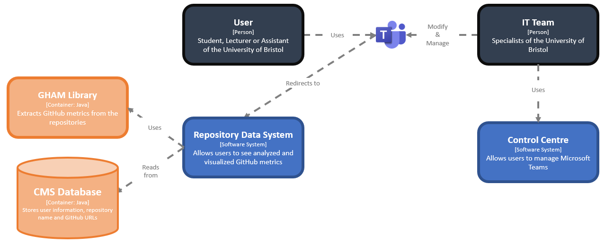
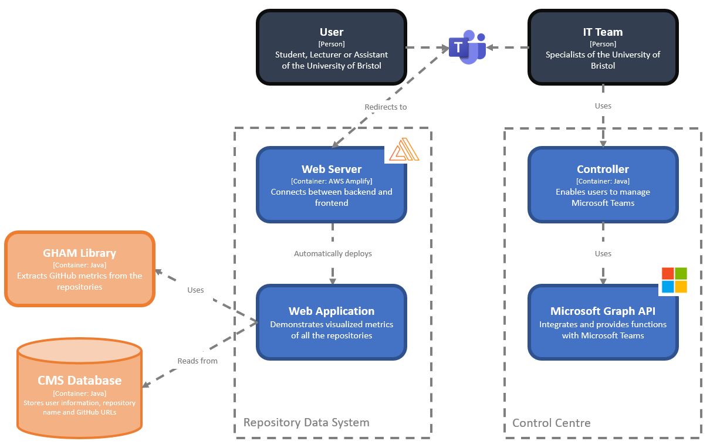
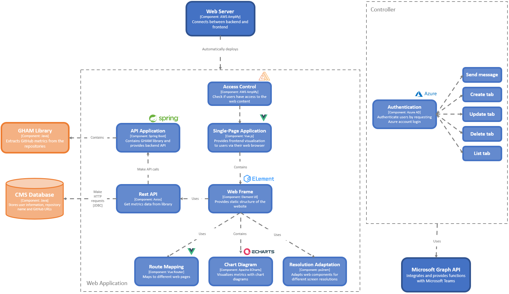

**2021-R-SPEAC – Portfolio**

Abdisamed Ali, Evangeline Zhou, Hao Yee Lim, Rares Bucur, Zhiyu Cai

**Overview**

Our group has been tasked with developing a software solution for a real-life client. We used the agile development methodology which allowed us to write and refactor code at a constant, sustainable pace while accomplishing our objectives.

**Our Client**

Our client for the SPEAC project is Dr. Daniel Schien, a Computer Science lecturer who is working at the University of Bristol and oversees the Software Engineering Project (SPE) module together with Dr. Simon Lock. As the module heavily relied on the information in the Github repository in evaluating each group’s academic performance, he is looking for a tool that can create insightful data from Github repositories and deliver it to Microsoft Teams in order to provide a better quality of education for the students.  

**Our Application Domain**

In the aspect of application domain, our application will benefit the whole organization of University of Bristol, as it is not only providing to the module leader for evaluating students’ academic performance, but also the students in the SPE module for analyzing their current performance in their project.

**The Project**

In our project, we are responsible for creating a server which can integrate the three groups and delivering up-to-date data to Microsoft Teams. Firstly, we send an HTTP get request to the SPE-CMS group, which will output all the project names when called through the SPE-CMS group. Then, the URLs corresponding to the project names are linked to the SPE-GHAM group's interface. Secondly, the SPE-GHAM group gives us a data library which they extracted from GitHub. Finally, we visualise the data and display them as charts.

**Our Vision**

In our project plan, we utilized tools such as Github for version control purposes and a Kanban board for distributing our tasks to compensate for the problem of working remotely.
For the technical part of our project, we have been using the Microsoft Graph API, Vue and AWS Amplify to fulfill the needs of our client. Besides that, CircleCI will also be deployed during the development stage as it will provide better transparency and farsightedness in the process of software development and delivery.

**Requirements**

**System Stakeholders**
Our software development project will cater to the needs of numerous groups who have a vested interest in the final product. These people, termed as ‘stakeholders’, will be identified below. We have written the names of user stakeholders in **bold**.

**University of Bristol IT Team:** They are responsible for maintaining our application and making it available to the SPE module’s leaders and students. Mark is part of the University of Bristol IT Team; he and his other colleagues will need to look over the system and to see if everything is safe and working before deploying it to the Teams platform.

**Educational Coordinators:** Professors Daniel Schien and Simon Lock are the educational coordinators of the unit and implicit, of the system we are developing. They will use the system to gain valuable information about the development process of all the teams from the SPE unit.

**Teaching Assistants:** Mary and George are part of a team of teaching assistants. They are in a higher year of study, and their role is to guide the teams and to make sure that everyone is working as intended. The TAs work will greatly improve with the use of this system because they will be able to see valuable data of the students' performance.

**Students:** Harry, Olivia and Alex are students at University of Bristol and taking the SPE unit. For the entirety of their development process, they will be able to see detailed data of their contributions to the project and to get an idea of what they could improve.

**Project Team:** Abdisamed, Rares, Hao, Evangeline and Zhiyu make up the project team who was assigned this Software Development Project. The five members must carefully plan and collaborate in order to produce a functional product.

**User Stories**

Below we have listed 3 of the most essential user stories for our **user stakeholders:**

**University of Bristol IT Team (Administrators)**

**As an IT specialist...**
 - I am responsible for the deployment and maintenance of the system developed by the teams assigned to this project, so that the users can access the data easily and securely.
 - I help manage the entirety of the system and provide University employees and students assistance and guidance so I need to be able to fully understand the application so I can answer any questions staff or students may have.

A basic sequence of steps for an IT specialist working with our system is shown below:\
     **1.** IT Specialist logs onto the admin panel.\
     **2.** IT Specialist verifies the integrity and security of the system.\
     **3.** IT Specialist finds no issues with the system.\
     **4.** Proceeds to adding a new tab inside the MS Teams channel with the website link.\
     **5.** Once the IT Specialist completes the code review, data about the repositories will be loaded into that tab.

Alternative flow:\
     **5a.** IT specialist decides  to log off and return to the admin panel later.\
     **5b.** All the data that the IT Specialist sent to MS Teams is present.

Exceptional flow:\
     **3a.** IT Specialist finds an issue with the system and chooses to terminate the project early.

**Educational coordinators (Lecturers)**

**As an educational coordinator...**
 - I want to standardize the requirements and factors after I am able to make an impression of how a student is performing in a team.
 - I want to be able to highlight one team in particular so I want to be able to view data by repositories so I can organise information efficiently.
 - I’m always being asked questions by students and teaching assistants so I want to be able to search for some data in a repository quickly to provide information efficiently.

A basic sequence of steps for an educational coordinator that wants to find more information about a repository using our system is shown below:\
     **1.** Lecturer searches for the tab inside the SPE channel.\
     **2.** Lecturer successfully finds the tab inside the channel.\
     **3.** Proceeds to looking for a specific repository.\
     **4.** Lecturer analyses the data and makes an idea of that repository in terms of performance of the whole team.

Alternative flow:\
     **3a.** Proceeds to looking for a specific student from a repository.\
     **3b.** Lecturer finds the student and he is able to get valuable insights about his performance in the team.

Exceptional flow:\
     **2a.** Lecturer is not able to find the required tab.\
     **2b.** Lecturer contacts the IT Team and communicates the issue.\
     **2c.** The IT Team looks into it and remediates the problem.

**Students**

**As a student...**
 - I want to draw conclusions based on the data shown and to see what parts I need to improve.
 - I want to observe my progress in the project and to see where I am sitting alongside my teammates.
 - I need to be able to navigate easily and find the data I am looking for in a user-friendly manner.  

A basic sequence of steps for a student who wants to find out more information about his performance in his github repository using our system is shown below:\
     **1.** Students search for the tab inside the SPE channel.\
     **2.** Students are able to find the tab.\
     **3.** Students log into the system in order to access the data.\
     **4.** They proceed to search for their own repository.\
     **5.** Students find and analyse the data about their performance in the team.

Alternative flow:\
     **4a.** Students proceed to searching for another repository.\
     **4b.** Students can look over the data from another repository to make an idea of how other teams are performing.

Exceptional flow:\
     **3a.** Students are not able to sign into the system.\
     **3b.** They contact the lecturers about this issue.\
     **3c.** The lecturers then contact the IT Team to look into this issue and try to remediate it.

**User Requirements**

We believe that the user story “I want to be able to find data from a repository in particular ” is of main interest to our app as it includes most of the functionalities of our system. Below, we decomposed this user story into atomic implementation requirements:

|**Code**|**Description**|
| :-: | :-: |
|**1**|**System must be visible in Ms Teams**|
|1.1|Users should be able to easily view their own project analytics|
|1.2|Users should be able to see all projects analytics|
|**2**|**Users must be able to carry out data analysis**|
|2.1|Users within the SPE unit must have access to the tab|
|2.2|Users must have access to the data charts assigned to their repository|
|**3**|**System must be easy to use**|
|3.1|Users besides the IT Team should not configure anything themselves|
|3.2|Users should not have to install anything locally|
|3.3|Users must not have an AWS account in order to log in|
|3.4|Logging in should not take more than a couple of seconds|
|3.5|The UI of the website must be intuitive and user-friendly|

***Personal Data, Privacy, Security and Ethics Management***

Personal Data

Our application will not be collecting any personal data from users. However, we may display some personal information from the CMS API. These will include:

* User information:
    * First name
    * Last name

*Collecting User Consent*

As we will not be collecting any information from the user, we are not required to collect their consent, as this would have already been done by the CMS or where the data was gathered initially.

However, we will need to ensure that any of the personal information that is displayed on the SPEAC application can only be viewed by those who are authorised to view it.

*Cookie Law*

Our application will not be using any cookies.

Our project does not require any data stored on users’ computers or devices, as the data is gathered from the CMS API. Hence, there is no need to comply with the cookie law in our application.

*Managing Personal Data and Security*

Our application will not need to manage any personal data as we will not be storing any data. However, to ensure that only authorised users will be able to view the web application we have implemented MSAL(Microsoft Authentication Library) to ensure that users outside a given organisation will not be able to view the data on our web app

*Ethics and Complying with GDPR*

Our application does have some ethical concerns as we will be displaying some personal information about students. For this reason, ethics pre-approval, route B lecturer approval, was applied for.

Article 5 of GDPR sets out seven key principles. These principles are shown below, as well as how we plan to comply with them:

* Purpose limitation and Data minimisation
    * We Will only be displaying students names so that it will be easier to distinguish between different students
* Accuracy
    * We will ensure that the personal data displayed will not be misleading
* Storage limitation
    * We will not be storing any data
* Integrity and confidentiality (security) and Accountability
    * Authenticating users using MSAL
    * We will take appropriate measures to securely use personal data.

**Architecture**

*Level 1: System Context*

The Level 1 Diagram shows the fundamental software system that we are currently using in our application. When a user tries to view the analyzed data from their or others’ Github Repository, they are able to view it through the website tab in their Microsoft Teams channel. The custom website tab will be provided by the University of Bristol IT Team who will deploy it through the Control Center which allows them to list, update, delete and add tabs in Microsoft Teams.

*Level 2: Container diagram*

In our C4 level 2 diagram, we zoom-in to the system boundary with a container diagram. This diagram will show the high-level shape of the software architecture and how responsibilities are distributed across it. In the Repository Data System, we used Vue.js framework to build our frontend instead of React because Vue provides built-in state management and built-in router. Besides that, Vue is also progressive, unlike monolithic frameworks, designed to be adaptable and easy to integrate with other tools. We also used Spring Boot to deploy our backend for the application as the Spring Web dependency has all the tools we need. Our backend will also import the Java library created by the GHAM group and send the generated analyzed data back to our frontend to be displayed in a form of multiple types of charts. For our Single-Page Application, we deployed it by using AWS Amplify. In the Control Center Diagram, we used Microsoft Graph API to integrate it with Microsoft Teams. In this way, the admin can easily deploy our web page on Microsoft Teams tab for lecturers, assistants and students to view more detailed information about the SPE projects.

*Level 3: Component*

In the level 3 diagram, we decompose each container further to identify the major structural building blocks and their interactions. For the Single-Page Application, we designed a sign in page to authenticate users. This will help us improve the security measures for our application as the webpage contains every SPE project groups’ data. In our project, we are highly concerned with the security issue in our application since our webpage contains the data for the whole SPE group projects. Hence, we utilize the service provided by AWS Amplify to authenticate users before viewing the analyzed data. In our Vue framework, we imported echart.js to visualize data using interactive charts to provide users a better understanding on their project. Besides that, we also imported Axios to fetch data from the database created by the CMS group. In our backend, we used Spring Web dependency to create a REST API to allow our backend to send analyzed data to our frontend for visualization purposes. On the Controller side, we first have to request an authentication token for accessing the services provided by the Microsoft Graph API. With those services, we are able to build and provide functionality such as listing, adding, updating and deleting tabs for the users. We also implemented a sign in system using the access control through AWS Amplify to authenticate users to the webpage. This will help us improve the security measures for our application as the webpage contains every SPE project groups’ data.

**Development Testing**

In developing our application, we utilized multiple branches in our Github repository due to the complexity of our project. This way, we managed to develop different components of our application in an organised manner and to keep track of what everybody is working on.
 Our development testing strategy used a combination of unit testing by using JUnit and manual testing, as our application used Microsoft Graph API which requires users to initialize the Graph functionality by authenticating themselves. As a result, this created a problem as users will have to login to their Microsoft Developer account during the process of testing which means we would have to hardcode the account name and password in our test which might cause security issues to our members. By doing manual tests, we could prevent security issues and at the same time achieve the same result that we wanted . Besides doing unit and manual tests, we also  tried a continuous integration(CI) approach by trying to integrate our project with the CircleCI system. However, we realised this was not the best approach particularly to our part in the project, because everytime we tried to push a new version of our code to the Github platform, the continuous integration system was checking for one test case in particular which required the user to log in with the credentials of the Microsoft Developer account. We believe that the test case ‘testAddTab’ is of particular interest to our application. It emphasizes an important part of our project as it creates the tab where all the data will be found. Below you have a brief description of the test case together with a link to it on our github repository.

 |**Test Case**|**Test Case Description**|**Expected Outcome**|**Actual Outcome**|
 | :-: | :-: | :-: | :-: |
 |
***testAddTab()***
|
Checks if Microsoft Graph is able to add a tab to the specific group and channel id by comparing the displayname and websiteURL from the listTab function
|
1. assertEqual(expected display name, actual display name) return true, where expected is the name of the tab showed in the tab list and matches it with the name given when creating with dummy data

` `2. assertEqual(expected websiteURL, actual websiteURL) return true, where expected is the websiteURL of the tab showed in the tab list and matches it with the websiteURL given.
|Same as expected outcome|

https://github.com/spe-uob/2021-R-SPEAC/blob/c2f183766020694c516498dbd592ceb6135d82b3/Graph/src/test/java/speac/AppTest.java#L77-L91

**Reflection**

Our development cycle spanned over two weeks and given the short time that was allocated to our development process, we believe we have met both our own personal expectations and our client’s expectations. We managed to create a long-running server with an admin panel capable of multiple functionalities. The main functionality of our app allows the admin to send data on a web page inside a newly created tab in the SPE channel. With this, we managed to satisfy all our functional and non-functional requirements. We also managed to develop our project in an agile manner, as we created multiple branches to try  managing our work distribution properly and so that everyone can work on different parts of the project at the same time without getting into merge conflicts.

**Challenges**

One challenge was to learn the service provided by Microsoft Graph API which is a relatively new cloud service provided by Microsoft. It has very little documentation and a very small community on StackOverFlow. To solve this issue, we had to go through the documentation on every single relevant function provided by the Microsoft Graph API in order to integrate our project with Microsoft Teams. Besides that, the app’s scopes permission has delayed us a few days in terms of development but we were able to solve it after clearly understanding the concept behind it. However, we would say this is our biggest success for the project as it provides the most fundamental technology in our project.
 
Another challenge was to set a full stack architecture of our web application, from selecting javascript framework to linking to other groups with spring and axios. Most members were new to the technologies, so we made great effort learning and binding things together to build our app.
 
Due to covid, all our team members had to work remotely. It was extremely difficult to discuss and collaborate with our teammates frequently as everyone was working from their home at different time zones. However, we managed to have regular meetings to discuss our project and having a Kanban board in our repository helped us to keep track of our team members’ progress. Even though we found some solution to solve this problem, it has caused some damage to our project’s development.
 
Besides having problems with teammates working remotely, we also faced a problem of collaborating with other groups as our project requires us to fetch data from the CMS group and use the Java library provided by the GHAM group. All three groups did not manage to communicate properly early in the development process and not many people had much of an idea what the other groups besides theirs are doing exactly, in order to provide some guidance related to their project accordingly for making the connection between the other projects as smooth as possible. Thus, we received the data needed a little late in the development process but we managed to get the system fully functional, making use of both the CMS group and GHAM group.

**Impact on application domain**

Across these three groups that worked on this data pipeline, our purpose was to demonstrate to our client that a long-running server solution for getting and sending data to Microsoft Teams making use of the Graph API and the library provided by the GHAM group is realistic and scalable. We believe that our system will positively impact the University of Bristol and especially the SPE unit. The unit coordinators will be able to see and show the students the metrics based on which they will get marked on and they will be able to see in a more organized and efficient way some parts that the students could improve on in their development process.